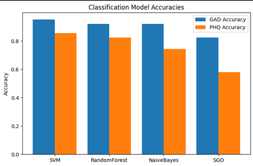
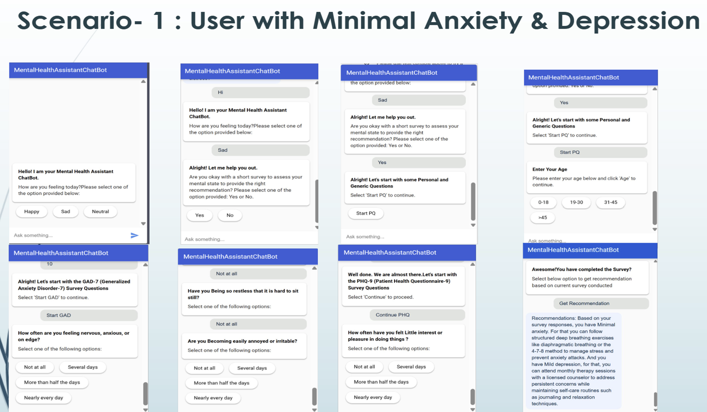
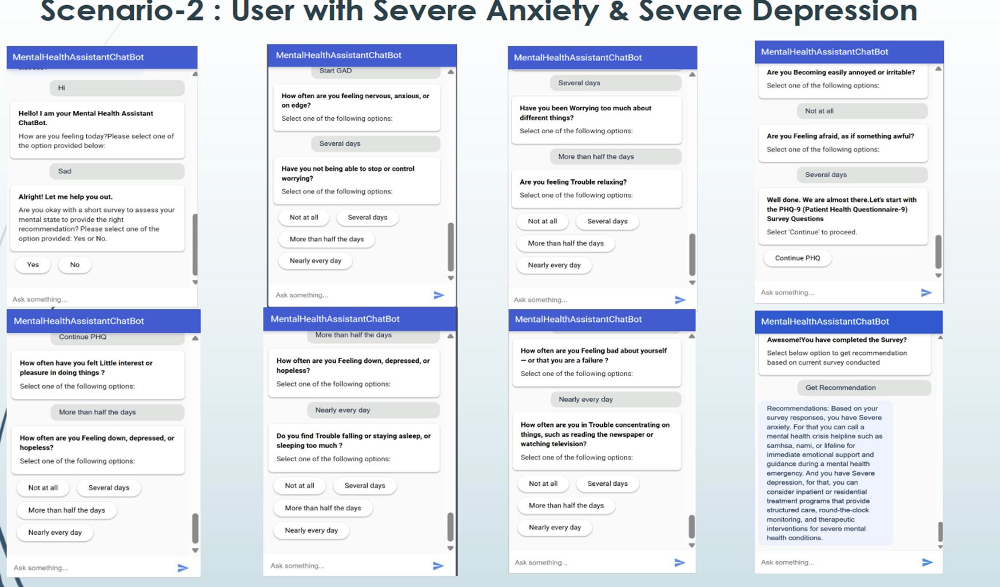
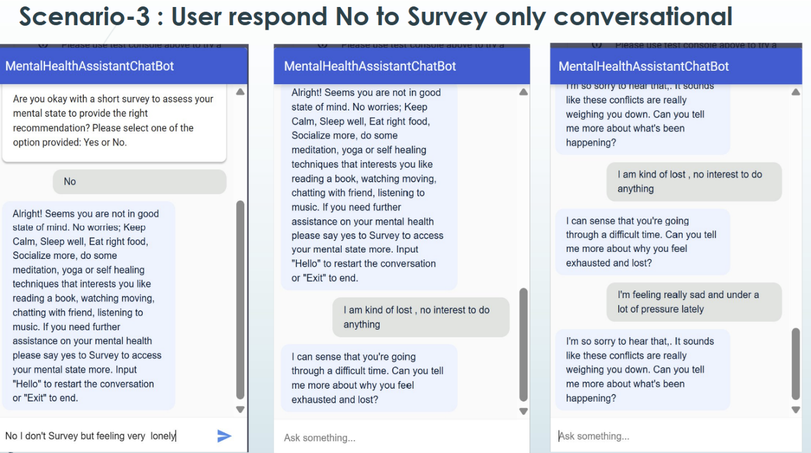
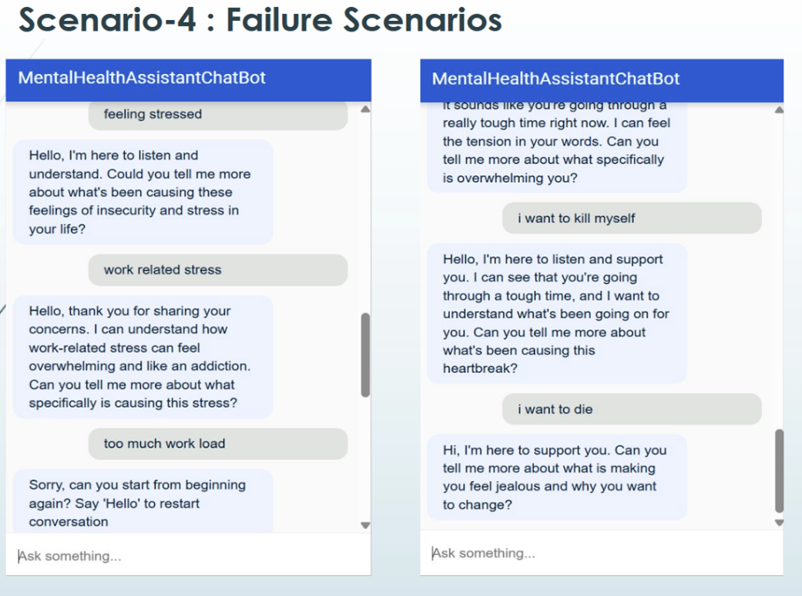

# Mental Health Chatbot Recommender System

A conversational AI system for mental health assessment and personalized recommendations using GAD-7, PHQ-9, and sentiment analysis.

---

## Features

- **Survey-based assessment** (GAD-7 & PHQ-9) for anxiety and depression severity.
- **Conversational AI** for users who opt out of the survey, with sentiment analysis and clustering.
- **Personalized recommendations**: self-help, professional, or emergency resources.

---

## System Overview


*System architecture and workflow*

---

## How It  Works

1. **User interacts** with the chatbot (Dialogflow).
2. **Survey path**: If user agrees, GAD-7 and PHQ-9 are administered, responses classified using ML models (SVM, etc.), and recommendations are generated.
3. **Conversational path**: If user declines, chatbot uses sentiment analysis and clustering to provide relevant support.

---

## Dialogflow Intents


---

## Model & Recommendation Flow


---

## Model Performance

**Classification Model Accuracies:**



*Comparison of model accuracies for GAD-7 and PHQ-9 classification. SVM performed best overall.*

---

## Results

- **Classification accuracy**: SVM performed best for both GAD-7 and PHQ-9.
- **Distribution of results:**


---

## Example Scenarios

The system was tested with different user journeys to demonstrate its capabilities and limitations:

### Scenario 1: User with Minimal Anxiety & Depression
A user completes the survey and reports minimal symptoms. The system provides self-help recommendations.



---

### Scenario 2: User with Severe Anxiety & Severe Depression
A user completes the survey and reports severe symptoms. The system recommends professional or emergency help.



---

### Scenario 3: User Responds "No" to Survey (Conversational Only)
A user declines the survey and interacts with the chatbot. The system uses sentiment analysis and clustering to provide conversational support.



---

### Scenario 4: Failure Scenarios
Edge cases where the chatbot faces ambiguous or critical user inputs, highlighting areas for improvement in handling crisis or unclear responses.



---

## Quick Start

```bash
git clone https://github.com/yourusername/mental-health-recommender.git
cd mental-health-recommender
pip install -r requirements.txt
python app.py
