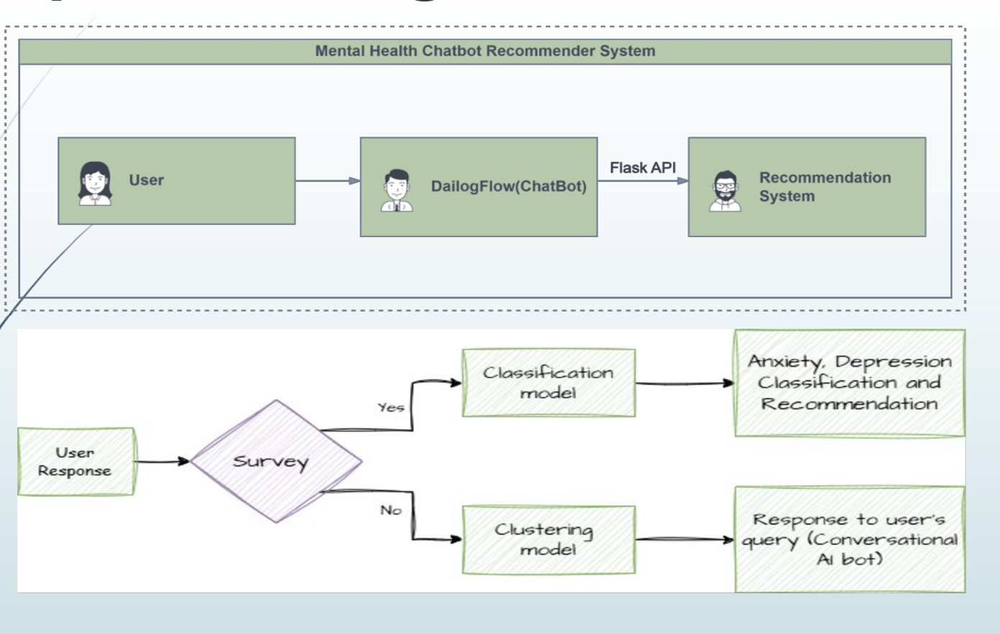
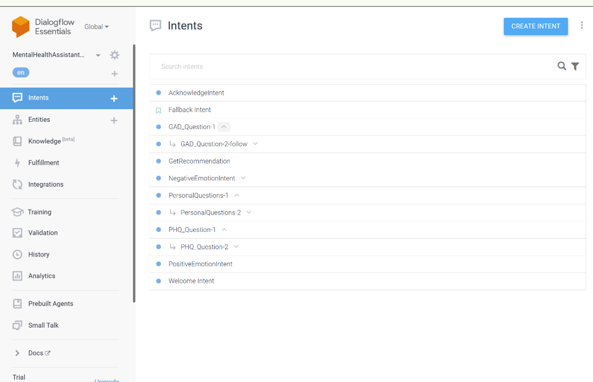
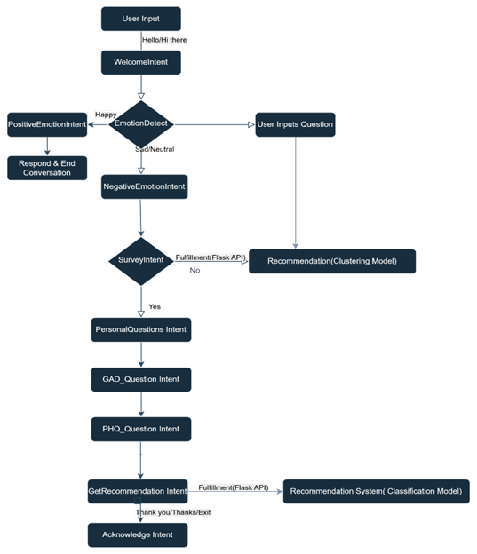
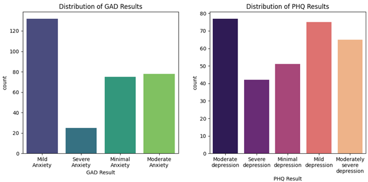

# Mental Health Recommender System

A conversational AI system for mental health assessment and personalized recommendations using GAD-7, PHQ-9, and sentiment analysis.

---

## Features

- **Survey-based assessment** (GAD-7 & PHQ-9) for anxiety and depression severity.
- **Conversational AI** for users who opt out of the survey, with sentiment analysis and clustering.
- **Personalized recommendations**: self-help, professional, or emergency resources.

---

## System Overview


*System architecture and workflow*

---

## How It Works

1. **User interacts** with the chatbot (Dialogflow).
2. **Survey path**: If user agrees, GAD-7 and PHQ-9 are administered, responses classified using ML models (SVM, etc.), and recommendations are generated.
3. **Conversational path**: If user declines, chatbot uses sentiment analysis and clustering to provide relevant support.


*Survey and conversational flow*

---

## Dialogflow Intents



---

## Model & Recommendation Flow



---

## Results

- **Classification accuracy**: SVM performed best for both GAD-7 and PHQ-9.
- **Distribution of results**:



---

## Example Scenario


*User with minimal anxiety & depression*

---

## Quick Start

```bash
git clone https://github.com/yourusername/mental-health-recommender.git
cd mental-health-recommender
pip install -r requirements.txt
python app.py
